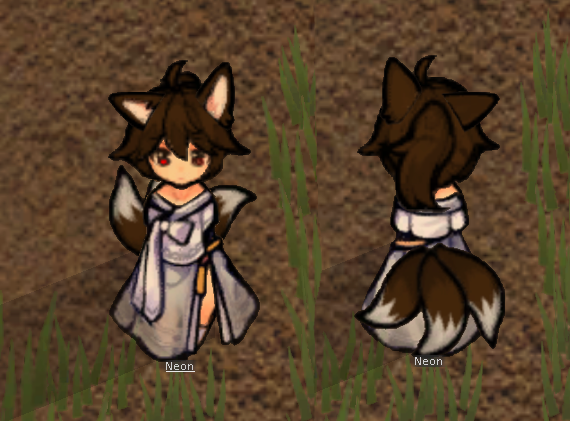
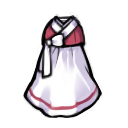
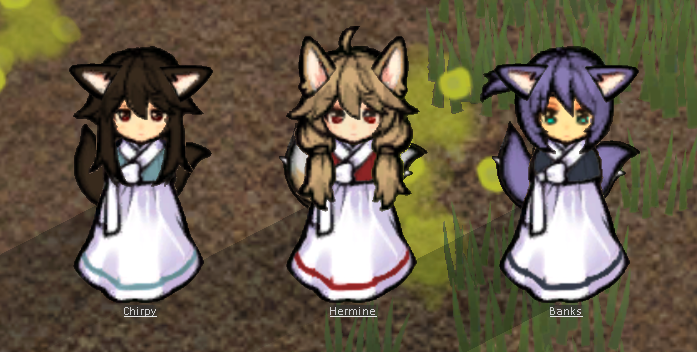

# Rimworld Tinkering
Art by GloomyLynx

**Fix for Wildman event for custom races** 
Whenever a wildman event occurs, Rimworld ignores the custom race's backstories and randomly assigns a backstory from the entire pool of backstories. This is fixed by calling two seperate events. The first is the Wanderer join event, this is an event which respects a custom race's backstory. However, the wanderer will immediately join the player's faction and not act like a wildman. This is fixed by combining it with the Running Wild event which will cause a player's character to immediately revert to a wildman.

**Ear Fix** 
 
The legacy version of Kurins had an issue with how the ears are rendered depending on the direction of the character. Note the character's right ear is located at screen left when it is facing the camera. With the back turned, the right ear is still on screen left when it should be on screen right

 
This has been fixed in this version

**Cloth Colours** 
 
The legacy version colour for apparel was dependent on the texture. That means any character donning the above apparel would have the same colour .

 
In this version, apparel now takes on the colour of the material it was created from. This is fully compatible with "Dubs Paint Shop"

**Spacer Armour** 
 
If the mod "Save Our Spaceship 2" is loaded. The file automatically patches the spacer suit to become an EVA suit to allow for space exploration.
